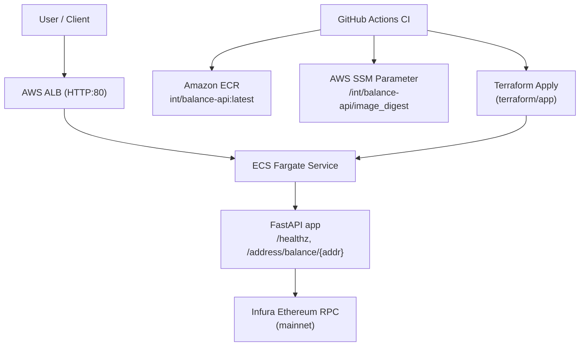

## Ethereum Balance API (FastAPI on ECS)

### Overview
This service exposes a simple HTTP endpoint implemented in Python with FastAPI. It retrieves an Ethereum address balance via Infura API. It is containerized, deployable to AWS ECS Fargate via Terraform, and ships with a CI workflow to build and push the image.



## Directory structure
```text
.
├─ src/
│  └─ app.py                 # FastAPI service
├─ Dockerfile                # Container build (non-root user, uv install)
├─ Makefile                  # Dev, Docker/ECR, and Terraform targets
├─ .github/workflows/
│  ├─ plan.yml               # Plan on PRs and feature/* branches
│  ├─ apply.yml              # On main: build/push, SSM publish, terraform apply
│  └─ ci.yml                 # ECR image build/push job
└─ terraform/
   └─ app/                   # ECS app infrastructure
      ├─ config.tf           # Backend/provider + SSM image data source
      ├─ input.tf            # Variables (incl. SSM param names)
      ├─ ecs.tf              # Cluster, task def, service
      ├─ elb.tf              # ALB, target group (ip), listener
      ├─ security_group.tf   # ALB and service SGs
      ├─ cwl.tf              # CloudWatch log group
      └─ iam.tf              # Task execution role and SSM read policy
   └─ bootstrap/             # (Optional) state bucket/lock bootstrap
      └─ main.tf             # S3 bucket/KMS/optional lock table (used initially)
```

## Basic Usage for Presentation

- Health Endpoint: `curl balance-api-1857254788.us-west-2.elb.amazonaws.com/healthz`

## Non-checksum address
`curl balance-api-1857254788.us-west-2.elb.amazonaws.com/address/balance/0xc94770007dDa54cF92009BFF0dE90c06F603a09f`

## Checksum address
`curl balance-api-1857254788.us-west-2.elb.amazonaws.com/address/balance/0xc94770007dda54cF92009BFF0dE90c06F603a09f`

### API Contract
- Route: `GET /address/balance/:address`
- Params:
  - `address` (path): Ethereum address; MUST be 0x-prefixed and EIP-55 checksummed
- Behavior:
  - Network: mainnet only
  - Block tag: `latest` only
  - Caching: in-memory TTL (default 5s), configurable via `CACHE_TTL_SECONDS`
- Response (200):
```json
{
  "address": "0xC94770007dDa54cF92009BFF0dE90c06F603a09f",
  "network": "mainnet",
  "blockTag": "latest",
  "balance": "0.0001365",
  "balanceWei": "136500000000000",
  "rpcLatencyMs": 45,
  "headBlockNumber": "0x1234abcd"
}
```
- Errors: `400` for invalid address; `502` for upstream provider errors; `500` otherwise.

### Why wei vs ether matters (practical)
- On-chain JSON-RPC uses wei (hex). UI uses ether. Mixing units causes 1e18 mistakes. We return both: `balance` (ether, string) and `balanceWei` (string) to avoid precision loss.

### Which block tag to query
- For this PoC: `latest` only (tiny reorg risk acceptable). Future: expose `safe`/`finalized` via query param.

### Networks (nets)
- Mainnet only for this PoC. Testnets/L2s omitted; can be added with minor changes to RPC URL handling.

### Security
- No secrets in code. INFURA is passed via environment (`INFURA_PROJECT_ID` or `INFURA_URL`).
- Container runs with `python:3.12-slim` base which keeps image minimal. In production, run as non-root and read-only filesystem (can be tightened further).

### Observability
- Structured logging via FastAPI/Uvicorn. Extend with OpenTelemetry if needed.

### Deployment
- Container built by Dockerfile. Terraform provisions ECS Fargate, ALB, SGs, and a service with two tasks for HA in multiple AZs. ALB DNS is exported.

### CI/CD
- feature/* branches and any PR:
  - Run `terraform plan` in `terraform/app`.
- main merges:
  1) Build multi-arch (amd64/arm64) Docker image
  2) Push `:latest` to Amazon ECR
  3) Publish image digest (`repo@sha256:…`) to SSM at `/int/balance-api/image_digest`
  4) `terraform apply -auto-approve` in `terraform/app`

---

## Follow-up Questions and Answers

### How can we make this deployment secure from bad actors?
- Private subnets for tasks, ALB in public subnets; SGs least privilege.
- AWS WAF on ALB; rate limiting and IP reputation lists.
- OIDC for CI → AWS (no long-lived keys), store secrets in AWS Secrets Manager + KMS.
- Image scanning (Grype/Trivy), SBOM and image signing (Cosign), minimal base image.
- Input validation (EIP-55), strict timeouts, retry with backoff, circuit breaker on provider failures.

### Is this deployment HA? How to improve HA?
- ECS service runs 2+ tasks across AZs behind an ALB. Health checks and autoscaling can be added.
- Improve: multi-AZ ALB, desired_count >= 2, target tracking on CPU/RPS, multi-region with Route53 failover.

### How can we deploy changes 100+ times a day?
- Trunk-based development, small PRs, fast CI, canary or blue/green deployments with automatic rollback.
- Infra as code with policy checks (Checkov), protected main with required checks, preview envs.

### How would you scale to thousands of customers per minute?
- Horizontal scaling via ECS autoscaling; enable keep-alive and connection pooling.
- Add Redis/ElastiCache cache for hot addresses; set bounded TTL to reduce provider calls.
- Multi-provider abstraction with health scoring and failover.

### How would you monitor outages? What do alerts integrate with?
- Metrics: request rate, latency p50/p95/p99, error rates, provider error codes, cache hit rate.
- Tracing with OpenTelemetry → X-Ray/OTel backend.
- Dashboards and SLOs; alert to PagerDuty/Slack on burn-rate/error spikes and ALB 5xx.

---

## Local Development
```bash
make venv install
make run INFURA_PROJECT_ID=xxxx
curl "http://localhost:3000/address/balance/0xc94770007dda54cF92009BFF0dE90c06F603a09f"
```

## Docker / ECR
```bash
make ecr-login
make ecr-build        # multi-arch build and push to ECR, updates SSM digest
```

## Terraform (ECS Fargate)
```bash
make tf-init
make tf-plan
make tf-apply
```
